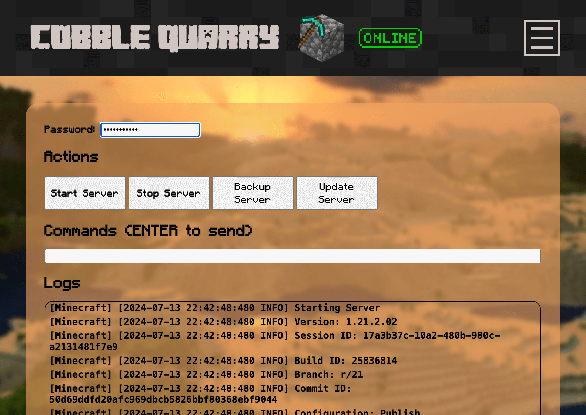

# Cobble Quarry - A simple and lightweight server manager for Minecraft Bedrock



## Features:

- Automatic server updates.
- Automatic server backups (only if players were online).
- Automatically shutdown server host computer, if no players are online for 30 minutes (remote restarts possible).
- Send in-game commands from a self hosted website (password protected) directly to your Minecraft server! Like adding a player to the whitelist, giving some player an item, banning a player, ... Everything the Minecraft offers as in-game command can be used.
- Action Buttons: Backup Server, Update Server, Start Server, Stop Server
- Multi-Server support (Multiple Minecraft Servers on one host computer).
- Displays the whole in-game and also internal logs
- Possibility to add an "admin" with max in-privileges and "mods" with lesser in-privileges. Sending commands or actions is all guarded behind authentication, so no random person can harm your Minecraft server.

## Requirements:

A server running on an Ubuntu based operating system like Ubuntu, Xubuntu, Lubuntu, ...
**Windows support is not planned.** It might work on Windows, although I doubt it, but never tested it. Deno and javascript usually are more or less cross compatible, but sometimes it's some details where it fails. On Windows, you definitely need to compile the project again and cannot simply download my "Release".

If you want to test it, check the make-release.sh script and immitate those steps manually on a Windows terminal. Also, setting the parameters works a bit differently on Windows. I won't afford the time to support Windows setups though, based on past experiences.

## Quick Installation (extended setup below) - Only run the server manager

**NOTE:** I recorded a video for the extended installation, which is described further below, but if you don't understand the manual, maybe it helps: https://www.youtube.com/watch?v=bMNqDBrC-lI

1. Download the latest release to your Ubuntu based OS: https://github.com/raphaellueckl/cobble-quarry/releases
1. Open the zip archive and extract its contents (1 folder, 1 file)
   1. Move both things into a folder, where you want to initialise your Minecraft server.
   1. If you already have an existing server, just put it into its folder.
1. Start the server with a terminal command in that folder: `./cobble` (it there is an error about it not being executable, make it executable)
1. For more features and boot parameters, head on to the section "Boot Parameters"
1. Unrelated to this application: If your friends should be able to reach your server, you need to open the ports `TCP 19132`, `UDP 19132`,`TCP 19133`, `UDP 19133` in your router settings. Then, from your server host computer, open a browser and go to https://ip.me/ to find the IP of your Minecraft server. Share this IP with friends you want to play with.

## Boot Parameters

Note: All parameters are optional, although some are highly recommended!

Example usage:

```bash
ADMIN_PW=admin123 MOD_PW=mod123 AUTO_SHUTDOWN=1 DISABLE_AUTO_UPDATES=1 BACKUP_PATH=/home/username/Minecraft_backups ./cobble
```

- `ADMIN_PW` (Recommended) A freely chosen secure password for all your admin actions. If it is too easy, someone can completely destroy your server.
- `MOD_PW` (Recommended) If you don't want to distinguish between mods and admins, just providing an admin password is sufficient. Mods can execute all actions, except executing in-game commands (cheats, shutdowns, kicks, bans and other things).
- `BACKUP_PATH` (Recommended) If you want Cobble Quarry to issue automatic and/or manual backups for you, provide a path here.
- `AUTO_SHUTDOWN` Use this variable, if you want your server to shut down, it no player is online for 30 minutes.
- `MULTI_SERVER` If you run several servers on one machine and have `AUTO_SHUTDOWN` enabled, you need to set this to true, otherwise, one Minecraft server - if empty - will shutdown the host computer (and therefore kill all other servers).
- `DISABLE_AUTO_UPDATES` If you don't want Cobble Quarry to get and install the newest Minecraft versions automatically, set this variable!

## (Optional) Extended Installation - With focus on saving electricity

### Motivation

I run a Minecraft server on a very potent hosting machine (for great view distance and other reasons). The issue is, that most of the time, nobody is playing on it. So to save on power, I created `Cobble Quarry`. I have a `Raspberry PI` at home, that is online 24/7 (can be a very old model for the use case described here). That `Raspberry PI` is able to boot the Minecraft server over the "Wake on LAN" feature. The server then boots up and starts the Minecraft server hosting machine. The Minecraft server hosting machine itself automatically starts Cobble Quarry which manages (and boots) your Minecraft server.

To conceptualise it a bit better:

- 2 computers:
  - Minecraft host server (shutdown/offline if not being used). Power consumption: 100+ Watt/hour.
  - `Raspberry PI` (always on). Power consumption: 3-5 Watt/hour.
- Process:
  - Pi
  - -> has a web interface that requires a password (Website)
  - -> which will boot the host computer (running Minecraft Bedrock server software), if the correct password was entered
  - -> Minecraft host computer boots up
  - -> Doesn't require a password on boot
  - -> Automatically starts Minecraft over a linux service
  - Done! From there, backups, updates, and everything will all be taken care of.

### Steps to achieve that

Important: This is how I did it. There are a ton of other ways to achieve the desired result. I am also not here to support you on your setup or if any of my steps do not work for you. Please only open tickets for stuff that is related to the `Cobble Quarry` application.

1. Setup Wake on Lan:
   1. Enter the BIOS of your server host computer and make sure that "Wake on LAN" is enabled.
   1. Enter your router settings and check the MAC address of the server host computer. You can also get this address in other ways. It looks something like this: `00-B0-D0-63-C2-26`
   1. If you want to enable your friends to start the Minecraft server: Open the TCP port `8732` in your router settings.
1. Remote booting you server host computer:
   1. Start your `Raspberry PI` and login.
   1. Download any `Wake on Lan` service. I wrote one for myself, that requires you to have "nodejs" installed, but there are a ton of other services like that. If you want to checkout mine, here's the link: https://github.com/raphaellueckl/wol
   1. Enter the MAC-address from the server host computer.
      1. If you use my little script, download the code as zip.
      1. Unzip the folder
      1. Open a terminal in the folder
      1. run this command: `npm i`
      1. Then run `GO=mysecretpassword MAC=MinecraftServerHostMacAddress node wake-lordhagen.js`
      1. Open a web browser on that Pi and access the small service: http://localhost:8732/
      1. Enter the password you defined (here: `mysecretpassword`) and click `go` (and do this every time you want to start the server).
   1. See if you can boot your server host computer.
   1. Enable `login without password` on your server host computer. Otherwise, the minecraft server cannot boot up all on its own.
1. Setup a Minecraft service on your server host computer. See the example (replace values).
   1. Terminal: `sudo nano /etc/systemd/system/minecraft.service`
   1. Add the content from the example configuration below and adapt values.
   1. Terminal: `sudo systemctl daemon-reload`
   1. Terminal: `sudo systemctl enable minecraft.service`
   1. Terminal: `sudo systemctl start minecraft.service`
1. For a multi-server setup, repeat the previous step with another service name and location. Don't forget to adapt the `PORT` environment variable. They need to be different. In your Minecraft server, you also need to adapt the port on where the game client has to connect. Also adapt the backup location, otherwise you will put backups from multiple servers in the same folder. Not an issue, but probably not desired.

Note: If you ever need to stop the Minecraft service, I highly recommend stopping the Minecraft-server first. If you just kill the service, it will kill the Minecraft server, without shutting it down gracefully. This usually is no problem if it happens, but it's always better to shutdown the Minecraft server gracefully they way it is intended and not just kill it.

Minecraft service configuration (adapt all values, especially the `username`!):

```bash
[Unit]
Description=Minecraft
After=network.target

[Service]
Environment="ADMIN_PW=admin123"
Environment="MOD_PW=mod123"
Environment="AUTO_SHUTDOWN=y"
Environment="DISABLE_AUTO_UPDATES=y"
Environment="MULTI_SERVER=y"
Environment="BACKUP_PATH=/home/username/Minecraft_backups"
ExecStart=/home/username/Minecraft/cobble
WorkingDirectory=/home/username/Minecraft
User=username
Group=username
Restart=always

[Install]
WantedBy=multi-user.target

```

## Terminology

- Minecraft-Server: The `Minecraft Bedrock` server that you would usually download from Mojang here: https://www.minecraft.net/en-us/download/server/bedrock (not needed if you use Cobble Quarry, as it will manage that on its own).
- Cobble Quarry: The application that manages the Minecraft server software.
- Server host computer: The server machine (computer), that actually runs the Minecraft server software (and Cobble Quarry).
- Raspberry PI: A computer running 24/7 and being able to start "wake on lan" the server host computer.

## Feedback & Support

Discord: https://discord.gg/TARdDh4hN8
